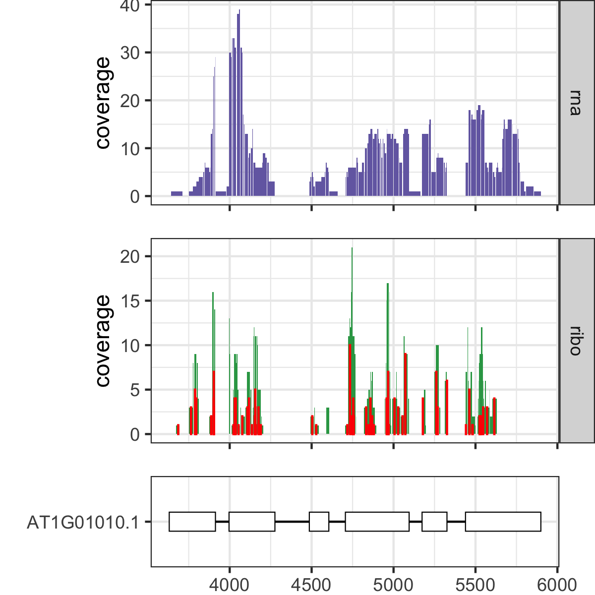

# Ribo_coverage
Visualize Ribo-seq and RNA-seq coverage over gene annotations.

## Example usage:
```
Rscript Ribo_coverage.R \
--genes test_genes.txt \
--annotation test.gtf \
--rna test_rna.bedgraph \
--ribo test_ribo.bedgraph \
--psite test_psite.wig
```

#### Example output
<p align="left"></p>.